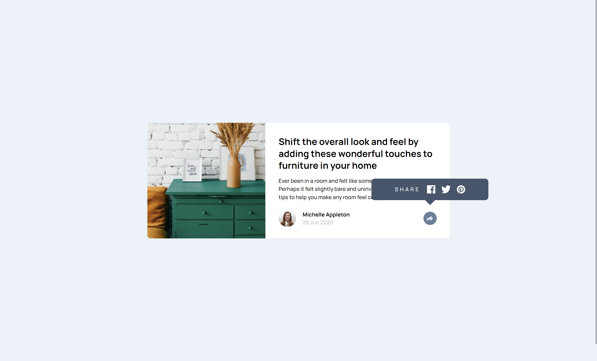
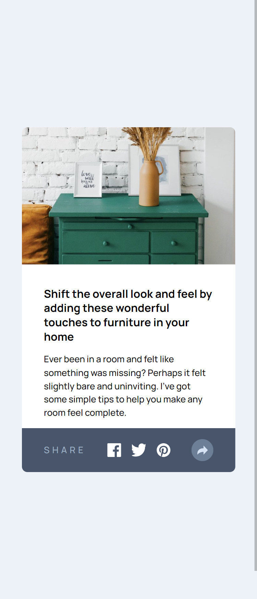

# Frontend Mentor - Article preview component solution

This is a solution to the [Article preview component challenge on Frontend Mentor](https://www.frontendmentor.io/challenges/article-preview-component-dYBN_pYFT). Frontend Mentor challenges help you improve your coding skills by building realistic projects. 

## Table of contents

- [Overview](#overview)
  - [The challenge](#the-challenge)
  - [Screenshot](#screenshot)
- [My process](#my-process)
  - [Built with](#built-with)
  - [What I learned](#what-i-learned)
  - [Useful resources](#useful-resources)
- [Author](#author)

## Overview

### The challenge

Users should be able to:

- View the optimal layout for the component depending on their device's screen size
- See the social media share links when they click the share icon

### Screenshot




## My process

### Built with

- HTML, SCSS, JS
- Mobile-first workflow
- Webstorm with Simple Hot Reload Server (install: `npm install -g simple-hot-reload-server`, start: `hrs`) and File Watcher with SCSS for building CSS

### What I learned

Use this section to recap over some of your major learnings while working through this project. Writing these out and providing code samples of areas you want to highlight is a great way to reinforce your own knowledge.

To see how you can add code snippets, see below:

- The script tag will load and execute the contents of main.js before the contents in the body have been rendered. Since there's every chance that you'll want to interact with the Document Object Model (DOM) in some way with your JavaScript file, you'll need a way to defer execution of the code until after the rest of the document has loaded.
```html
<script defer src="./main.js"></script>
```
- get Elements in js
```js
const author = document.getElementById('author');
```
- Modify class names of elements
```js
shareBtn.className = 'dark-button';
shareBtn.classList.add('dark-button');
shareBtn.classList.remove('dark-button');
shareBtn.classList.contains('dark-button');

tooltip.style.visibility = 'visible';
```
- handle varying screen widths
```js
window.addEventListener('resize', function() {
  const viewportWidth = window.innerWidth || document.documentElement.clientWidth;
  // magic!
});
```
- triangle
```css
.triangle {
  width: 0;
  height: 0;
  border-left: 64px solid transparent;
  border-right: 64px solid transparent;
  border-top: 64px solid red;
}
```
- Get elements position, size,...
```js
const tooltipRect = tooltip.getBoundingClientRect();
width = tooltipRect.width;
```
- Tooltip: create outside of element with `overflow: hidden`


### Useful resources

- [Learn JavaScript](https://web.dev/learn/javascript)
- [The Modern JavaScript Tutorial](https://javascript.info/)
- [Using the Document Object Model](https://developer.mozilla.org/en-US/docs/Web/API/Document_Object_Model/Using_the_Document_Object_Model)
- [How to Manipulate the DOM in JavaScript – Most Commonly Used Techniques](https://www.freecodecamp.org/news/javascript-document-object-model-explained/)
- [How To Modify Attributes, Classes, and Styles in the DOM](https://www.digitalocean.com/community/tutorials/how-to-modify-attributes-classes-and-styles-in-the-dom)
- [6 Ways to select HTML Elements with Javascript](https://bydavidlange.com/6-ways-to-select-html-elements-with-javascript/)
- [Loops](https://www.codecademy.com/learn/introduction-to-javascript/modules/learn-javascript-loops/cheatsheet)

## Author

- Github - [Sonja Krafft](https://www.github.com/sonmikrafft)
- Frontend Mentor - [@sonmikrafft](https://www.frontendmentor.io/profile/sonmikrafft)